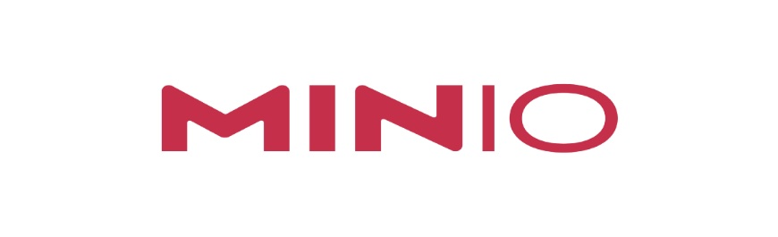

# Minio Labs Terraform

This repo deploys custom Minio Labs using Terraform.

This is in **ALPHA** and major changes will be made before it is ready for general consumption.

- [Minio Labs Terraform](#minio-labs-terraform)
  - [Requirements](#requirements)
  - [Components Deployed](#components-deployed)
  - [IMPORTANT NOTICE](#important-notice)
  - [Install Instructions](#install-instructions)
  - [Deploying additional environments](#deploying-additional-environments)
  - [Teardown Instructions](#teardown-instructions)
  - [About Minio](#about-minio)

## Requirements
- Terraform installed on your local machine (https://learn.hashicorp.com/tutorials/terraform/install-cli)
- A cloud account and keys for:
  - AWS
  - DigitalOcean
  - Hetzner Cloud

## Components Deployed
- Ubuntu 20.04 Server(s)
- VSCode Server
- Various Minio deployment code

## IMPORTANT NOTICE
You will incur some cost as a result of deploying this to your cloud provider. Minio is not responsible for those costs.

Deployments are provided "AS-IS" with no guarantee on availability or complete functionality. These will be tested regularly, but ultimately you are responsible for deploying / maintaining / tearing down these systems.

## Install Instructions
- Make sure pre-requisites are complete
- Run `git clone https://github.com/mjminio/minio-lab-terraform.git`
- cd `minio-lab-terraform`
- Run `cp terraform.tfvars.dist terraform.tfvars`
- Update the following fields in the `terraform.tfvars` file
  - deployment_name
  - minio_password
  - code_server_password
  - Change the desired provider `enabled` field to `1`
  - Change the `count` on the desired cloud provider to `1`
  - Input your tokens/keys for the desired cloud provider
- Run `make setup` and the complete deployment will run. This will take approx 5 minutes before your server is ready. Be patient.
- To access the systems, the links and passwords will be output at the completion of the `make setup` command, or you can open `files/{deployment_name}/minio-ui-links.txt` file to find access instructions for VSCode in the web browser
- You can now start Minio on your deployed server using the desired method. Do not run both at the same time, it will fail. Do either/or:
  - To deploy Minio using Docker, run `./files/start-minio-docker.sh`
  - To deploy Minio native, run `./files/start-minio-native.sh`

## Deploying additional environments
If you would like to deploy multiple environments at the same time and not have them interfere with each other, we have provided a way to do that. We are leveraging `terraform workspaces` to make this happen.

Simply change the `deployment` name in the `terraform.tfvars` file to the environment you want to interact with and run your commands.

**Example:**
- Change `deployment_name` in `terraform.tfvars` to `minio-lab1` and then run `make setup`. This will deploy in the Terraform workspace `minio-lab1` and prepend all server names with `minio-lab1`.

- Change `deployment_name` in `terraform.tfvars` to `minio-lab2` and then run `make setup`. This will switch workspaces and not interfere with `minio-lab1` infra.

- Change `deployment_name` in `terraform.tfvars` back to `minio-lab1` and then run `make destroy` and it will only tear down the resources related to `minio-lab1` leaving all `minio-lab2` infrastructure in place.

- Lastly, to clean up `minio-lab2`, change `deployment_name` in `terraform.tfvars` to `minio-lab2` and then run `make destroy` and the `minio-lab2` content will be removed as well.

## Teardown Instructions
- In the `minio-lab-terraform` directory, with the desired `deployment_name` set in `terraform.tfvars`, run `make destroy`. This will remove all deployed components and no additional billing should be done for that particular deployment once this command is run and the components are removed.

## About Minio

MinIO offers high-performance, S3 compatible object storage.
Native to Kubernetes, MinIO is the only object storage suite available on every public cloud, every Kubernetes distribution, the private cloud and the edge. MinIO is software-defined and is 100% open source under GNU AGPL v3.

- **Website:** https://min.io/
- **Official Github:** https://github.com/minio
